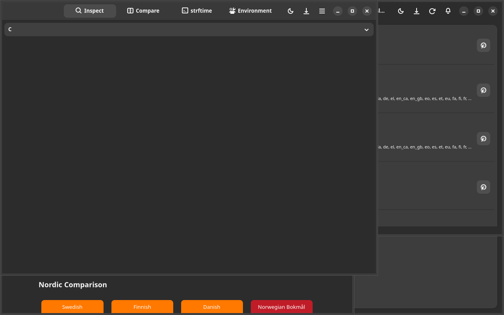
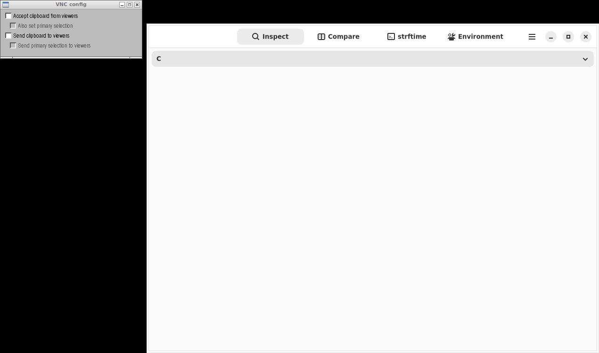

# Locale Tester

## Screenshot



A GTK4/Adwaita application for inspecting and comparing system locale settings on Linux.



## Features

- Inspect any installed system locale: dates, time, numbers, currency, percent
- Collation order — see how sample words sort under different locales
- Weekday names, month names, AM/PM indicators
- Decimal point, thousands separator, currency symbol details
- Compare two locales side by side
- strftime tester — enter custom format strings and see results
- LC_* environment variables overview

## Installation

### Debian/Ubuntu

```bash
# Add repository
curl -fsSL https://yeager.github.io/debian-repo/KEY.gpg | sudo gpg --dearmor -o /usr/share/keyrings/yeager-archive-keyring.gpg
echo "deb [signed-by=/usr/share/keyrings/yeager-archive-keyring.gpg] https://yeager.github.io/debian-repo stable main" | sudo tee /etc/apt/sources.list.d/yeager.list
sudo apt update
sudo apt install locale-tester
```

### Fedora/RHEL

```bash
sudo dnf config-manager --add-repo https://yeager.github.io/rpm-repo/yeager.repo
sudo dnf install locale-tester
```

### From source

```bash
pip install .
locale-tester
```

## 🌍 Contributing Translations

This app is translated via Transifex. Help translate it into your language!

**[→ Translate on Transifex](https://app.transifex.com/danielnylander/locale-tester/)**

Currently supported: Swedish (sv). More languages welcome!

### For Translators
1. Create a free account at [Transifex](https://www.transifex.com)
2. Join the [danielnylander](https://app.transifex.com/danielnylander/) organization
3. Start translating!

Translations are automatically synced via GitHub Actions.
## License

GPL-3.0-or-later — Daniel Nylander <daniel@danielnylander.se>
